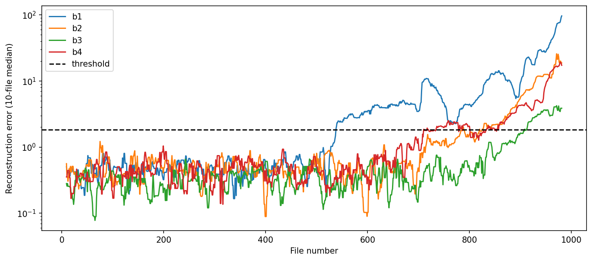

# Bearing Failure Detection from Vibration Data

Unsupervised anomaly detection on the NASA/IMS bearing run-to-failure dataset. Bearing 1 was flagged **74 hours (3.1 days) before failure**, with **zero false alarms** across 1,554 control-bearing observations.

## Problem

Four bearings ran on a shared shaft for ~7 days until an outer race failure occurred in bearing 1. Vibration was recorded at 20 kHz in 1-second snapshots every 10 minutes — 982 usable files of 20,480 samples across 4 channels. The 2nd test set was used: one accelerometer per bearing rather than two, a single failure event, and the smallest of the three subsets, which keeps computing time low.

One failure event, no labels, three bearings that never failed. Supervised learning isn't available, so the detector has to learn healthy behaviour and flag departures from it.

## Approach

1. Validate the data — file integrity, timestamp regularity, dead and clipped channels, spectral content
2. Reduce each snapshot to four time-domain features per bearing: RMS, kurtosis, peak, crest factor
3. Standardise against the healthy baseline (first 500 files)
4. Fit PCA on healthy files only, retain 2 components
5. Score each file by reconstruction error — how far it sits from healthy behaviour
6. Smooth, threshold, and require persistence before raising an alarm

Every parameter is fitted on healthy data only, so the detector could have been configured before the fault began.

## Results

| Metric | Value |
|---|---|
| Detection lead time (b1) | 74.0 h / 3.08 days |
| False alarm rate (b2-b4, pre-alarm window) | 0 / 1554 = 0.00% |
| Alarm continuity after first trip | 444/444 files, no reset |
| Margin over next bearing | 30 h |

The alarm holds through the mid-degradation dip where the initial spall wears smooth — an RMS threshold would have cleared there, two days before failure.

## Files

- `bearing-failure-detection.ipynb` — full analysis, checks and detector

## Data

IMS Bearing Dataset (2nd test). Generated by the NSF I/UCR Center for Intelligent Maintenance Systems (IMS), University of Cincinnati, with support from Rexnord Corp. in Milwaukee, WI. Accessed through the [Kaggle mirror](https://www.kaggle.com/datasets/vinayak123tyagi/bearing-dataset); also available [directly](https://phm-datasets.s3.amazonaws.com/NASA/4.+Bearings.zip).

**Data set citation:** J. Lee, H. Qiu, G. Yu, J. Lin, and Rexnord Technical Services (2007). IMS, University of Cincinnati. "Bearing Data Set", NASA Prognostics Data Repository, NASA Ames Research Center, Moffett Field, CA.

**Reference:** Hai Qiu, Jay Lee, Jing Lin. "Wavelet Filter-based Weak Signature Detection Method and its Application on Roller Bearing Prognostics." *Journal of Sound and Vibration* 289 (2006) 1066-1090.
